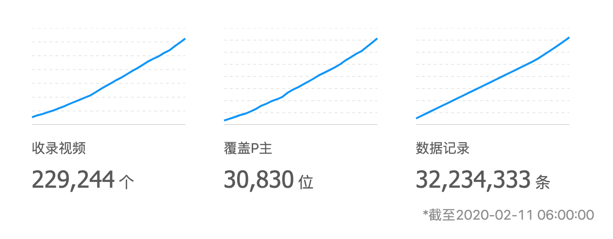

# other - 其他

其他杂项API。这里的API参数与格式相对比较随意，可能与其他API不同，请认真阅读。

# statdaily - 每日记录

## URL

GET：[https://api.bunnyxt.com/tdd/v2/statdaily](https://api.bunnyxt.com/tdd/v2/statdaily)

## 请求参数

参数名 | 数据类型 | 是否必须 | 默认值 | 取值范围 | 备注
:- | :- | :- | :- | :- | :-
start_ts | Integer | 否 | 无 | x > 0 | 起始时间，时间戳
end_ts | Integer | 否 | 无 | x > 0 | 结束时间，时间戳
pn | Integer | 否 | 1 | x > 0 | page num，通用请求参数
ps | Integer | 否 | 250000 | 1 < x <= 250000 | page size， 通用请求参数

## 响应内容

statdaily记录系统收录的视频、用户、视频记录数，每天更新一次，用于实现首页的那三个图表。



statdaily对象结构如下：

字段名 | 数据类型 | 备注
- | - | - 
id | Long | 主键，通用返回参数
added | Integer | 添加时间的时间戳，通用返回参数
video_count | Long | 系统收录的视频总数
member_count | Long | 系统收录的用户总数
video_record_count | Long | 系统收录的视频记录总数

根据请求的参数查找到的statdaily对象数组。若不存在任何满足条件的对象，则返回空数组。

示例：[https://api.bunnyxt.com/tdd/v2/statdaily?start_ts=1581230433&end_ts=1581403234](https://api.bunnyxt.com/tdd/v2/statdaily?start_ts=1581230433&end_ts=1581403234)

```JSON
[
  {
    "id": 101,
    "added": 1581285601,
    "video_count": 228951,
    "member_count": 30757,
    "video_record_count": 31918448
  },
  {
    "id": 102,
    "added": 1581372000,
    "video_count": 229244,
    "member_count": 30830,
    "video_record_count": 32234333
  }
]
```

响应头部包含`x-total-count`字段。

# updatelog - 更新日志

## URL

GET：[https://api.bunnyxt.com/tdd/v2/updatelog](https://api.bunnyxt.com/tdd/v2/updatelog)

## 请求参数

参数名 | 数据类型 | 是否必须 | 默认值 | 取值范围 | 备注
:- | :- | :- | :- | :- | :-
last_count | Integer | 否 | 5 | x >= 0 | 最近的日志的条数，**0表示获取所有日志**

## 响应内容

updatelog为系统更新日志记录，由站长手动维护，只记录较大更新事件。

updatelog对象结构如下：

字段名 | 数据类型 | 备注
:- | :- | :- 
added | Integer | 添加时间的时间戳，通用返回参数
type | Integer | 更新类型，1：添加；2：删除；3：修改
content | String | 日志内容

根据请求的参数查找到的updatelog对象数组。若不存在任何满足条件的对象，则返回空数组。

示例：[https://api.bunnyxt.com/tdd/v2/updatelog?last_count=2](https://api.bunnyxt.com/tdd/v2/updatelog?last_count=2)

```JSON
[
  {
    "added": 1581238268,
    "type": 1,
    "content": "添加视频封面上的视频tag显示。"
  },
  {
    "added": 1581083526,
    "type": 1,
    "content": "添加周刊自动算分功能，整合到视频详情页面。"
  }
]
```