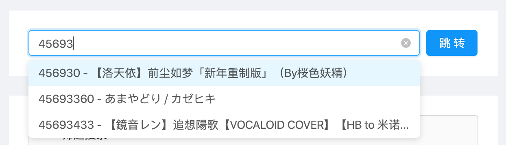

# video - 视频

本系统收录的视频

字段名 | 数据类型 | 备注
- | - | - 
id | Long | 主键，通用返回参数
added | Integer | 添加时间的时间戳，通用返回参数
aid | Integer | aid
videos | Integer | 分P数
tid | Integer | tid
tname | String | 分区名称
copyright | Integer | B站视频版权，1：原创；2：转载
pic | String | 封面图片url
title | String | 标题
pubdate | Integer | 发布时间的时间戳
desc | String | 简介
tags | String | 标签，用";"分隔
mid | Integer | UP主mid
code | Integer | 视频状态，0为正常，其余为各种异常
hasstaff | Byte | 是否有staff，-1：未定义；0：无；1：有
singer | String | 歌姬，用";"分隔，
solo | Byte | 是否独唱，-1：未定义；0：否；1：是 
original | Byte | 是否原唱，-1：未定义；0：否；1：是 
employed | Integer | 周刊收录期数，-1：不满足条件不收录；0：确定收录但不确定期数；正整数：收录期数
isvc | Byte | 是否是VC曲目，-1：不确定；0：不是；1：是；2：系统判定是但还需人工审核；3：存疑；4：是VC但被排除了；5：可能不应该收录的
engine | Byte | 30区下的曲目分类，-1：未判断；0：VC；1：非中文；2及以上为其他中文虚拟歌姬引擎
freq | Byte | 歌曲更新频率等级，0：一天一次，将在未来的版本中废弃
activity | Byte | 歌曲活跃度，0：普通；1：活跃；2：热门
recent | Byte | 是否最近投稿，0：否；1：本周新作；2：本日新作
member | Object | UP主信息
laststat | Object | 最近一次更新的数据，若无则为null
staff | Array | staff数组，若无则为null

其中：

`member`对象，即[member](member.md)对象的一部分

字段名 | 数据类型 | 备注
- | - | - 
name | String | 昵称
sex | String | 性别
face | String | 头像url
sign | String | 个性签名

`laststat`对象，即[video_record](video_record.md)对象的一部分

字段名 | 数据类型 | 备注
- | - | - 
added | Integer | 添加时间的时间戳，通用返回参数
view | Integer | 播放
danmaku | Integer | 弹幕
reply | Integer | 评论
favorite | Integer | 收藏
coin | Integer | 硬币
share | Integer | 分享
like | Integer | 点赞

`staff`数组中的对象，即[video_staff](video_staff.md)对象

字段名 | 数据类型 | 备注
- | - | - 
mid | Integer | mid
name | String | 昵称
face | String | 头像url
title | String | 分工

示例：[https://api.bunnyxt.com/tdd/v2/video/78977256](https://api.bunnyxt.com/tdd/v2/video/78977256)

```JSON
{
  "id": 225395,
  "added": 1579878149,
  "aid": 78977256,
  "videos": 1,
  "tid": 30,
  "tname": "VOCALOID·UTAU",
  "copyright": 1,
  "pic": "http://i0.hdslb.com/bfs/archive/38970300ed66bfdf787ee01af3ece91cab622b12.jpg",
  "title": "万古生香【2020拜年祭单品】",
  "pubdate": 1579877678,
  "desc": "万古千秋，代代有玲珑气象。\n风云史往，页页赋秀骨生香。",
  "tags": "2020拜年祭单品;万古生香;",
  "mid": 43855,
  "code": 0,
  "hasstaff": 1,
  "singer": "洛天依,",
  "solo": 1,
  "original": 1,
  "employed": 0,
  "isvc": 1,
  "engine": 0,
  "freq": 0,
  "activity": 2,
  "recent": 0,
  "member": {
    "sex": "保密",
    "name": "litterzy",
    "face": "http://i1.hdslb.com/bfs/face/e026493863004b4ad37f9585be61c71e24e1dc71.jpg",
    "sign": ""
  },
  "laststat": {
    "added": 1581336020,
    "view": 4946995,
    "danmaku": 31113,
    "reply": 32569,
    "favorite": 232832,
    "coin": 293710,
    "share": 41546,
    "like": 283454
  },
  "staff": [
    {
      "mid": 43855,
      "name": "litterzy",
      "face": "http://i1.hdslb.com/bfs/face/e026493863004b4ad37f9585be61c71e24e1dc71.jpg",
      "title": "UP主"
    },
    {
      "mid": 541480,
      "name": "填词的那个Vagary",
      "face": "http://i1.hdslb.com/bfs/face/1041b8f5c654d3fa91a9b8f4e24cb0356eb07f78.jpg",
      "title": "作词"
    },
    {
      "mid": 3241451,
      "name": "Creuzer",
      "face": "http://i2.hdslb.com/bfs/face/79079ff6377871eb7d01d64b2f6d08a2fc448d5e.jpg",
      "title": "调校"
    }
  ]
}
```

# 根据aid获取

## URL

GET：[https://api.bunnyxt.com/tdd/v2/video/{aid}](https://api.bunnyxt.com/tdd/v2/video/{aid})

## 请求参数

URL参数 | 数据类型 | 取值范围 | 备注
- | - | - | -
aid | Integer | x > 0 | 视频aid

## 响应内容

根据给定的aid查找到的一个video对象。若不存在该aid的对象，则返回空。

# 根据条件查询

## URL

GET：[https://api.bunnyxt.com/tdd/v2/video](https://api.bunnyxt.com/tdd/v2/video)

## 请求参数

参数名 | 数据类型 | 是否必须 | 默认值 | 取值范围 | 备注
- | - | - | - | - | -
vc | Integer | 否 | 0 | 0, 1 | 是否为VC视频，0：否；1：是
start_ts | Integer | 否 | 无 | x > 0 | 视频投稿时间，起始，时间戳
end_ts | Integer | 否 | 无 | x > 0 | 视频投稿时间，结束，时间戳
activity | Integer | 否 | 无 | 0, 1, 2 | 视频活跃度，0：普通；1：活跃；2：热门
recent | Integer | 否 | 无 | 0, 1, 2 | 是否最近投稿，0：否；1：本周新作；2：本日新作
title | String | 否 | 无 | / | 视频标题（包含该部分）
up | String | 否 | 无 | / | UP主昵称（包含该部分）
order_by | String | 否 | pubdate | [pubdate, view, danmaku, reply, favorite, coin, share, like] | 排序依据
desc | Integer | 否 | 1 | 0, 1 | 排序，0：从小到大；1：从大到小
pn | Integer | 否 | 1 | x > 0 | page num，通用请求参数
ps | Integer | 否 | 20 | 1 < x <= 20 | page size， 通用请求参数

## 响应内容

根据请求的参数查找到的video对象数组。若不存在任何满足条件的对象，则返回空数组。

响应头部包含`x-total-count`字段。

# 随机视频

## URL

GET：[https://api.bunnyxt.com/tdd/v2/video/random](https://api.bunnyxt.com/tdd/v2/video/random)

## 请求参数

参数名 | 数据类型 | 是否必须 | 默认值 | 取值范围 | 备注
- | - | - | - | - | -
count | Integer | 否 | 1 | 1 <= x <= 20 | 获取视频个数

## 响应内容

随机`count`个视频构成的video对象数组。

> [!NOTE]
> 并非在所有收录的视频中随机，是在一个单独的经过筛选的所有视频的一个子集中随机抽取。

# 仅aid与标题

## URL

GET：[https://api.bunnyxt.com/tdd/v2/video/aidtitle](https://api.bunnyxt.com/tdd/v2/video/aidtitle)

## 请求参数

参数名 | 数据类型 | 是否必须 | 默认值 | 取值范围 | 备注
- | - | - | - | - | -
aid | Integer | 是 | 无 | x > 1000 | 视频aid的前半部分

## 响应内容

视频的aid以`aid`参数为开头几个数字的所有视频的aid与title字段组成的对象的数组，最多返回前20个。

示例：[https://api.bunnyxt.com/tdd/v2/video/aidtitle?aid=45693](https://api.bunnyxt.com/tdd/v2/video/aidtitle?aid=45693)

```JSON
[
  {
    "aid": 456930,
    "title": "【洛天依】前尘如梦「新年重制版」（By桜色妖精）"
  },
  {
    "aid": 45693360,
    "title": "あまやどり  / カゼヒキ"
  },
  {
    "aid": 45693433,
    "title": "【鏡音レン】追想陽歌【VOCALOID COVER】【HB to 米诺】【调声晒】"
  }
]
```

用于实现所有视频页的自动填充搜索框的下拉菜单内的内容。



# 根据aid更新

## URL

PUT：[https://api.bunnyxt.com/tdd/v2/video/{aid}](https://api.bunnyxt.com/tdd/v2/video/{aid})

## 请求参数

URL参数 | 数据类型 | 取值范围 | 备注
- | - | - | -
aid | Integer | x > 0 | 视频aid

请求体为一个video对象，包括需要修改的字段名和字段值。例如，对`aid`为1250752的视频修改`solo`字段为1，修改`singer`字段为"洛天依,"，则请求体包含以下对象：

```JSON
{
  "solo": 1,
  "singer": "洛天依,"
}
```

> [!NOTE]
> 只有本系统添加的补充与控制字段（打的标签，`singer`啊`original`啊啥的）可以通过此方法修改。从B站api获得的视频本体信息（`videos`啊`pubdate`啊啥的）是无法通过网页系统修改的，只有爬虫系统可以修改。

## 权限控制

需要`admin`权限。

## 响应内容

返回修改完后的video对象。